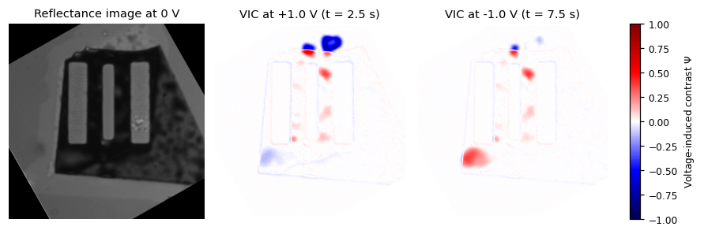

# operandoslit

[](https://doi.org/10.1038/s41563-026-02775-4)
[](https://doi.org/10.6084/m9.figshare.33269229)

Minimal analysis example for

> K. V. Saurav\*, N. Ronceray\*, B. Coquinot, A. D. Pizarro, A. Keerthi, T. Emmerich, A. Radenovic & R. Boya.
> **Direct imaging elucidates ionic memory in two-dimensional nanochannels.**
> *Nature Materials* (2026). https://doi.org/10.1038/s41563-026-02775-4
>
> \*These authors contributed equally.

By combining operando thin-film interferometry with electrokinetic measurements, we image two-dimensional (2D) nanochannels while ions are driven through them. Voltage-induced blistering of the confining walls is the origin of their memristive hysteresis.
This repository contains a curated Jupyter notebook that walks through the core of the analysis on one recording from the dataset. It goes from the raw current trace and reflectance images to blister maps, time traces and the descriptors used to classify blisters.

It is a readable starting point for the analysis workflow, not a script regenerating every figure of the paper.



## Contents

| | |
|---|---|
| [`operando_analysis_device1.ipynb`](operando_analysis_device1.ipynb) | the analysis notebook, with outputs |
| [`requirements.txt`](requirements.txt) | Python dependencies |
| [`data/`](data/) | where to put the raw data (not version-controlled) |
| [`LICENSE`](LICENSE) | MIT License |

## Quick start

```bash
git clone https://github.com/nronce/operandoslit.git
cd operandoslit
pip install -r requirements.txt
```

Download the two files of the folder **`Raw Data Device 1 (1M KCl, +-1V)`** from the figshare dataset
([doi:10.6084/m9.figshare.33269229](https://doi.org/10.6084/m9.figshare.33269229)) into `data/`:

```
data/
├── 241201_123908_1M_KCl_1V_0.1hz_4_1000H_1000W_N401_iv.csv
└── 241201_123908_1M_KCl_1V_0.1hz_4_1000H_1000W_N401_img.tif
```

and open the notebook:

```bash
jupyter lab operando_analysis_device1.ipynb
```

It runs in under a minute and needs about 1.5 GB of RAM.
Tested with Python 3.12, numpy 1.26, scipy 1.13, pandas 2.2, matplotlib 3.9, scikit-image 0.24 and tifffile 2023.4.

## What the notebook does

Device 1 (hBN / five-layer graphene / hBN nanochannels in 1 M KCl) is driven with $\Delta V(t) = \Delta V_0 \sin(2\pi f t)$, where $\Delta V_0 = 1$ V and $f = 100$ mHz.
Reflectance images are acquired at 10 frames per second, synchronised with the current recording.

1. **Electrokinetic data**: the 1 kHz current and voltage are averaged over each camera frame, giving the I–V characteristic and the conductance $G(t)$.
2. **Voltage-induced contrast (VIC)**: images are binned and rotated. For each pixel, the Michelson contrast $\Psi = (\eta(\Delta V) - \eta(0)) / (\eta(\Delta V) + \eta(0))$ relative to the image at rest is computed and mapped at ±1 V (cf. Fig. 2e).
3. **Individual blisters**: averaging $\Psi$ over regions of interest gives $\Psi(t)$, shown alongside $G(t)$, and the $\Psi$–$V$ characteristics (cf. Fig. 4).
4. **Kymograph**: $\Psi$ along a line versus time (cf. Fig. 3b).
5. **Blister descriptors**: the symmetry ratio $S = A_\mathrm{small}/A_\mathrm{large}$ and the contrast–conductance correlation $C = \langle \delta G \times |\Psi| \rangle$, computed per voltage cycle (cf. Fig. 5). The notebook reproduces the published values for the blisters it analyses.

## Data format

`*_iv.csv`: electrokinetic recording sampled at 1 kHz.

| column | content |
|---|---|
| `Time [s]` | time |
| `Image exposure` | camera exposure trigger (1 during exposure) |
| `Voltage out [V]` | applied voltage |
| `Current [A]` | measured current, **stored in µA** despite the header |

`*_img.tif`: ImageJ stack of 401 frames of 1000 × 1000 px, 16 bit. It holds one reference frame at rest followed by one frame per 100-ms trigger period.
The frame size and number are also encoded in the file name (`1000H_1000W_N401`).

## Citation

If you use this code or data, please cite the paper and the dataset:

```bibtex
@article{Saurav2026,
  author  = {Saurav, Kalluvadi Veetil and Ronceray, Nathan and Coquinot, Baptiste and Pizarro, Agustin D. and
             Keerthi, Ashok and Emmerich, Theo and Radenovic, Aleksandra and Boya, Radha},
  title   = {Direct imaging elucidates ionic memory in two-dimensional nanochannels},
  journal = {Nature Materials},
  year    = {2026},
  doi     = {10.1038/s41563-026-02775-4}
}

@misc{Saurav2026data,
  author    = {Saurav, Kalluvadi Veetil and others},
  title     = {Dataset of `Direct imaging elucidates ionic memory in two-dimensional nanochannels'},
  publisher = {figshare},
  year      = {2026},
  doi       = {10.6084/m9.figshare.33269229}
}
```

## License

The code is released under the [MIT License](LICENSE). The data are distributed via figshare under their own terms.

## Contact

For questions about the code, please open an issue.
Correspondence about the paper should be addressed to the corresponding authors listed in the article.
